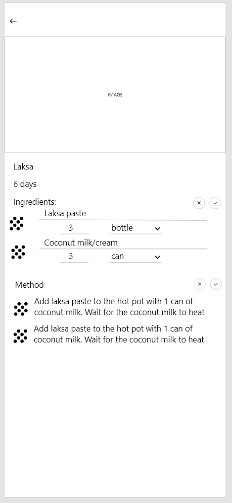

# RecipeMe

## API and database
SQLite is used for this application as the database engine. The API is using [go-sqlite3](https://github.com/mattn/go-sqlite3) for storing/retrieving the data from the endpoints.

All backend logic is located in the `/backend` directory. It also includes the `docker-compose.yml` and `Dockerfile` that setup the container for the API.

The database is on its one volume so that if you need to rebuild the docker image once the Go code is changed, you do not need to lose all the data. Also as part of that, if you decide to add a column to a table, it can be done by `docker exec my_app /root/entrypoint.sh table_name new_column column_type`
- `my_app` is the name of the docker container
- `table_name` is the name of the table you are trying to modify
- `new_column` is the name of the column you would like to add 
- `column_type` is the type of the column. e.g. `TEXT`, `INTEGER`

By default, the following tables are created:

1. The **recipe** table:
```sqlite
CREATE TABLE recipes(
    id INTEGER PRIMARY KEY AUTOINCREMENT,
    name TEXT,
    url TEXT,
    imageUrl TEXT,
    createdAt TEXT
);
```

2. The **portion** table:
```sqlite
CREATE TABLE portion(
    id INTEGER PRIMARY KEY AUTOINCREMENT,
    value TEXT,
    measurement TEXT,
    recipe_id INTEGER,
    FOREIGN KEY (recipe_id) REFERENCES recipes(id) ON DELETE CASCADE ON UPDATE NO ACTION
);
```

3. The **ingredient** table:
```sqlite
CREATE TABLE ingredient(
    id INTEGER PRIMARY KEY AUTOINCREMENT,
    name TEXT,
    measurement TEXT,
    value TEXT,
    sortOrder INTEGER,
    recipe_id INTEGER,
    FOREIGN KEY (recipe_id) REFERENCES recipes(id) ON DELETE CASCADE ON UPDATE NO ACTION
);
```

4. The **method** table:
```sqlite
CREATE TABLE method(
    id INTEGER PRIMARY KEY AUTOINCREMENT,
    value TEXT,
    sortOrder INTEGER,
    recipe_id INTEGER,
    FOREIGN KEY (recipe_id) REFERENCES recipes(id) ON DELETE CASCADE ON UPDATE NO ACTION
);
```

The **recipe** table has a relationsip `has_one` **portion** and `has_many` **ingredient**s, **method**s.

### Endpoints:
#### Recipe
- POST: http://localhost/recipe
- GET: http://localhost/recipes
- GET: http://localhost/recipe/{id}
- PUT: http://localhost/recipe/{id}
- DELETE: http://localhost/recipe/{id}

#### Portion
- GET: http://localhost/portions
- POST: http://localhost/portion/{recipe_id}
- DELETE: http://localhost/portion/{id}

#### Ingredient
- GET: http://localhost/ingredients
- POST: http://localhost/ingredient/{recipe_id}
- DELETE: http://localhost/ingredient/{id}

#### Method
- POST: http://localhost/method/{recipe_id}
- DELETE: http://localhost/method/{id}

## Idea:
A way to host the storage on your machine and have full control over where the data is saved, how manipulated. No ads, all features available.

## Wireframe
### March 2025
#### Landing page 


#### Landing page with filter open


#### Recipe view page


#### Recipe edit page


### Initial

On the left screen: at the top have a search bar and filter/sort icon. The recipe cards are placed 2 per row. Each recipe card will have support to show:

- image
- name
- portion
- number of ingredients
- time (currently it is not suported)

The right screen represents the modal for filter/sort dropdown. The ingredients' dropdown will offer multi checkbox and in sort dropdown a user can only select 1 item.


## Roadmap:
- Implement and update the design of the application.
- Add Type (breakfast, lunch, dinner, dessert, snack) to the recipe creation.
- Add split view based on the type
- Add functionality of increasing or decreasing the portion which results in the updated list of ingredients. 
- Exporting functionality of the recipe as a long screenshot.
- Make a companion watch app.
- Look into Gemini integration so that when asking to look for a recipe, it looks through this app first.
- Ability to have "Cooking mode" so that the phone screen does not turn off.
    1. Look into this feature on the watch as well.
<details>
    <summary><strong>Completed items</strong></summary>

- Setup docker container for backend (goLang is going to be used) ✅

- Create API in Go. Basic CRUD will do for now. The data should be saved to the locally stored database. ✅

```json
example of possible data for API
{
    "id": 1,
    "name": "Test",
    "portion": {
        "id": 1,
        "value": 2,
        "measurement": "days", // can be just "days" for now
    },
    "url": "", // the URL of the original recipe
    "image": "",
    "ingredients":  [
        {
            "id": 1,
            "name": "Onion",
            "measurement": "items", // can be items, grams, kgs, ml, cups, cans 
            "value": 1,
        }
    ],
    "methods": [
        {
            "id": 1,
            "sortOrder": 1,
            "value": "Turn the stove on"
        },
        {
            "id": 3,
            "sortOrder":2,
            "value": "Crack an egg",
        },
        {
            "id": 2,
            "sortOrder":3,
            "value": "Tun off the stove",
        },
        {
            "id": 4,
            "sortOrder":4,
            "value": "Clean the stove"
        },
    ],
    "createdAt": "",
}
```

- Setup basic mobile app using Kotlin. The app should be able to connect to the API and the CRUD functionality works as expected.
- DB should not be wiped if rebuilding image. If any new columns, they should just be aded to the DB rather than removing all data.
- Add Sort functionality in the app by:
    1. Name
    2. Portion
    3. Create Date
- Filter out the reipecs by ingredients. Being able to uncheck the ingredients and hide the recipes.

</details>